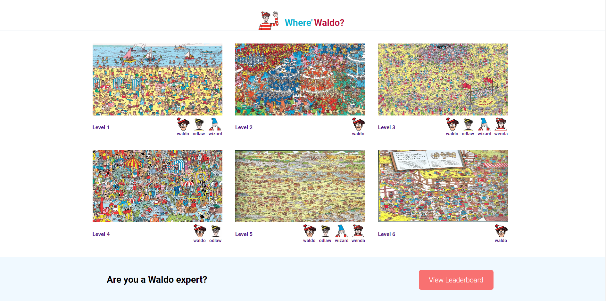

#Where is Waldo and Friends?

Can you find Waldo and his friend and become Waldo expert in all of the levels on the grid? 

**Link to project:** https://find-waldo-and-friends.herokuapp.com/

## How It's Made: 
**Tech used:** CSS, JavaScript, React, React-router, Node, Express, MongoDB

## Lessons Learned:
Learned how to perform CRUD operations, storing and retrieving the data from MongoDB, used MVC design patter in order to decouple the user interface, data and application logic.

